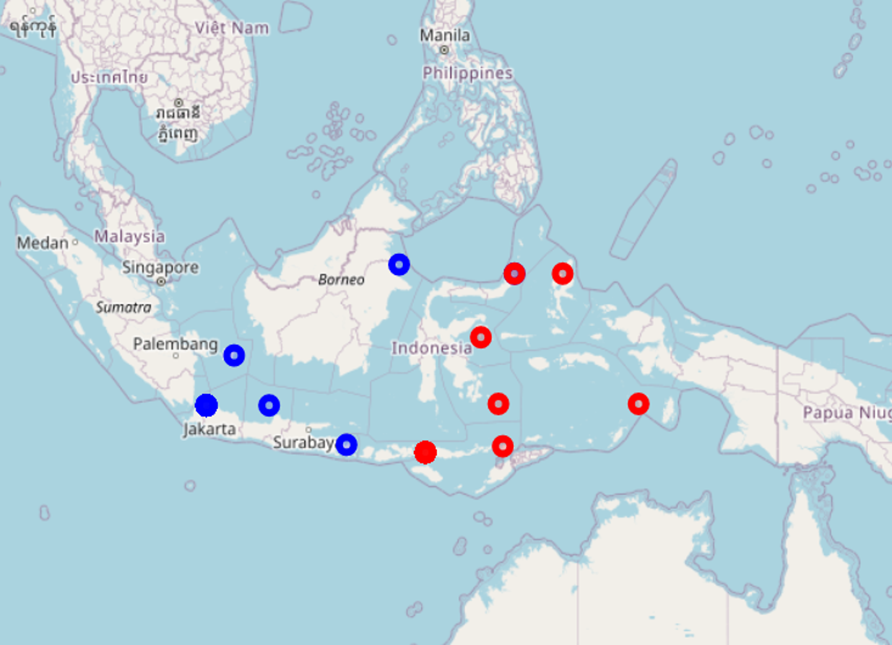

<body style="background-color:#CDB79E" >
```{r setup, include=FALSE}
knitr::opts_chunk$set(echo = TRUE, warning=FALSE, message = FALSE)
```

## **Welcome** to the final project page! 

**Caleb Sawyer** <br> BIOL-3100 <br> *Introduction to Data Analysis*

This project functions as a walkthrough and/or tutorial for Dr. Heath Ogden's BIOL4550 Molecular Evolution and Bioinformatics class final project, with my data as a reference, using **RStudio**. This is an alternative to using the MEGA 11 software we tinkered around with in class. This reflects my path through the project, and my choice of packages are just an example. There are many other alignment, model testing, phylogenetic tree, and tree viewer tools out there, that all work similarly. There are also important phylogenetic parameters that are not discussed here, but can change depending on your data set, taxa and evolutionary context.

The data set consists of cytochrome C oxidase subunit 1 (Cox1) amino acid sequences pulled from genbank based on the genus of bacterial samples taken from seagrass (*Syringodium isoetifolium*) around **Wallace’s Line**.

```{r, echo=FALSE}

```


Wallace's Line is a biogeographical border between Malaysia and Australasia, with distinct fauna differences on either side. Recent studies demonstrate similar patterns for microbiota, including fungi and bacteria.
<br> <br>
Out of the many samples taken, only 18 were determined to have significant differential abundance depending on their resident side of Wallace's line.

Those significant genera are the following:
```{r,echo=FALSE,}
sigtaxa <- as.vector(c(
"Mucilaginibacter","Rhizobium","Sphingomonas","Acinetobacter","Elizabethkingia",
"Bradyrhizobium","Aureitalea","Rhodospirillum","Arcobacter","Marixanthomonas",
"Pelagicoccus","Azonexus","Thiogranum", "Bizionia","Paracoccus",
"Vibrionimonas","Wandonia","Bauldia","Litorimonas","Anderseniella"))
```

```{r}
sigtaxa
```

Since the project requires a minimum of 30 taxa, at least 10 more from the 254 samples need to be chosen.

Using a random number generator using a randomly generated seed, we determined the other 10 samples from a list of all the taxa.
```
seed <- round(runif(1, 1, 2147483647))
```
```
seed

[1] 141372682

set.seed(141372682)

#random selection of other 10 taxa
newtaxa <- round(runif(10, 1, 254))

```

***

### Step 0
#### Load Packages:

```
library(tidyverse)
library(janitor)
library(bio3d)
library(BiocManager)
library(phangorn)
library(kableExtra)
library(ggtree)
```

```{r, echo=FALSE}
library(tidyverse)
library(janitor)
library(bio3d)
library(BiocManager)
library(phangorn)
library(kableExtra)
library(ggtree)
```


For alignment, I used Multiple Sequence Alignment (MSA) from the package BiocManager.

```
# - file manipulation
BiocManager::install("msa")
```
*Note: Any code chunks that add or modify local files are marked with "# - file manipulation". Any code chunks that involve long run times, like model testing, alignments, phylogenetic tree generation, etc. are marked with "# - long runtime" in the script. These shouldn't be run more than once. Save a local object or file, and load that going forward to avoid redundancy.*

***

### Step 1 
#### Read in the data

```
df <- 
  read_csv("./taxa_list_new_csv.csv") %>% 
  clean_names()
```

```{r,message=FALSE,echo=FALSE} 
df <- 
  read_csv("./taxa_list_new_csv.csv") %>% 
  clean_names()

df %>% 
  kable() %>%
  row_spec(0,color="black") %>% 
  kable_material_dark(lightable_options = 'hover') %>% 
  scroll_box(width="900px", height= "350px")
```
This csv is an excel spreadsheet my group fashioned while collecting sequences, taxa, genbank numbers, etc. It's not tidied up into a form we can work with easily in R, so that needs to be done first.

***

### Step 2 
#### Clean Up the data
*See code for details* -->
```{r, message=FALSE}

#duplicate fasta format name column and manipulate one
df$taxa <- 
  gsub("> ",">",df$taxa)

df$taxa_name_fasta=df$taxa

#The "\xa0" is a stand in for the ? square box "replacement" character
df$full_name <- 
  gsub("\xa0"," ",df$full_name)

df$gene <- 
  gsub("\xa0"," ",df$gene)

df$taxa <- 
  gsub("[()]","",df$taxa)

df$taxa <- 
  df$taxa %>%
  str_remove(">") 

df <- 
  separate(df,col=taxa,into = c("taxa_genus","sig_type"),sep=' ',convert=FALSE)

df$sig_type <- as.factor(df$sig_type)

df$aa_seq <- 
  df$aa_seq %>% str_trunc(15,ellipsis="...")

df$gene <- 
  df$gene %>% str_trunc(33,ellipsis="...")


df %>% 
  kable() %>%
  row_spec(0,color="black") %>% 
  kable_material_dark(lightable_options = 'hover') %>% 
  scroll_box(width="900px", height= "350px")

```

***
## Step 3
### FASTA Importing

Use list of GenBank numbers <br>
Get the compiled AA fasta file:
```{r, eval=FALSE, echo=FALSE}

# - file manipulation
get.seq(df$cox1_genbank,"cox1_all.fasta")

```
```{r, echo=FALSE}
fst <- 
  read.fasta("./cox1_all.fasta")

```


```
get.seq(df$cox1_genbank,"cox1_all.fasta")

fst <- 
  read.fasta("./cox1_all.fasta")
```
Viewing the fasta file in Notepad, it should look something like this:
<br>

```{r, echo=FALSE}
knitr::include_graphics("./cox1_all_notepadview.png")
```
<br> **Looks good!** <br>
All sequences are FASTA formatted properly, and can now be aligned!

***
## Step 4
### Align the Sequences
Using MSA <br>
```{r, eval=FALSE}
# - file manipulation
seqaln(fst, id=df$taxa_genus, exefile="msa",
       outfile="align1.fasta", protein=TRUE, seqgroup=FALSE,
       refine=FALSE, verbose=FALSE)
```
```
# - file manipulation
seqaln(fst, id=df$taxa_genus, exefile="msa",
       outfile="align1.fasta", protein=TRUE, seqgroup=FALSE,
       refine=FALSE, verbose=FALSE)
```

File made: "align1.fasta"
<br>
Now it's aligned in that fasta 
<br>
Now I need to get it into Phydat format for analysis

```{r}
cox1 <- read.phyDat("./align1.fasta",
                    format = "fasta",
                    type = "AA")

class(cox1)
```

***

## Step 5 <br>
### Model test for best fit
<br>
Model test to see which model best fits the data to use for phylogeny


```{r, eval=FALSE}
# runtime ~ 2 hr
# - file manipulation
mod <- modelTest(cox1)

write.csv(mod,file="model_test_cox1.csv",quote=FALSE,col.names=TRUE)

```

``` 
# runtime ~ 2 hr
# - file manipulation
mod <- modelTest(cox1)

write.csv(mod,file="model_test_cox1.csv",quote=FALSE,col.names=TRUE) 
```


File made: "model_test_cox1.csv"

```{r}
mod <- 
  read_csv("./model_test_cox1.csv")

mod %>% 
  kable() %>% 
  kable_material_dark(lightable_options = 'hover') %>% 
  scroll_box(width="900px", height= "350px")
```

<br>

### Picking a model

I want the model that has the best value for both BIC and AIC overall. <br>
So I'm going to sum them, divide by 2, and choose the lowest value. <br>
^ What this dumbass means to say is the minimum average: 

```{r}
mod$fit <- ((mod$BIC+mod$AIC)/2)

#Show best model based on min value of that new column
c(as.character(mod[mod$fit == min(mod$fit),2]),as.character(min(mod$fit)))

```

#### Best model: LG+G(4) with a value of "52175"

(Note for me: maybe thinking about making that a cute function)
<br> 

***
## Step 7
###Make the ML tree(s) <br>
-I've got the model to calculate the ML  <br>
-I've got the algined fasta <br>

...so its time to grow a tree.

```{r, eval=FALSE}
# - Runtime ~ 1 hr 15min
# - file manipulation
fitLG <- pml_bb(cox1, model="LG+G(4)")

saveRDS(fitLG, file="fitlg.rds")

```

File created: "fitlg.rds"

First Maximum Likelihood tree generated.

### Here, there's something I want to look into: bootstrapping.

The default option for pml gen is "[UltraFast bootstrapping](https://academic.oup.com/mbe/article/30/5/1188/997508)" (Minh, Nguyen, and Haeseler 2013), but I only really know the context around standard bootstrapping. So, since I found how to do both, why not compare bootstrap values?

```{r, message=FALSE}
fitLG <- 
  read_rds("fitlg.rds")
```
Setting up standard bootstrapping:
<br>
runtime ~ 1 hr <br>
- file manipulation<br>
```
bs <- bootstrap.pml(fitLG, bs=100, optNni=TRUE,
                     control = pml.control(trace = 0))
 
saveRDS(bs, file="bs.rds")

```
***
## Step 8

#### Plotting ultrafast BS vs standard BS to compare:
<br>
First step is ALWAYS: "Root your tree"
<br>
In this case: Outgroup = "Archaea"
<br> <br>

Root:
```{r}
bs <- 
  read_rds("bs.rds")

root <- 
  root(fitLG$tree,outgroup="Archaea",resolve.root=TRUE)
```

Troubles rooting. Need to figure that out...

### Plot:
```{r}
#Ultrafast Bootstrapping
ufbsplot<- 
  plotBS(root, p = .5, type="p", digits=2, main="Ultrafast BS")

#Assign standard bs values 
stdbs_tree <- plotBS(fitLG$tree, bs, type = "n")

#Standard Bootstrapping
stdbsplot <- 
  plotBS(root, bs, p = 50, type="p", main="Standard BS")
```

##### Convert from Phy to Newick format (or tree)

- file manipulation
```
Now from phy to tree: (newick format)
write.tree(fitLG$tree, "cox1_ufsb_nwk.tree")

write.tree(stdbs_tree, "cox1_stdbs_nwk.tree")
```
```{r,message=FALSE}
uf <-   
  read.tree("cox1_ufsb_nwk.tree")

std <- 
  read.tree("cox1_stdbs_nwk.tree")
```
***
## Step 9
### Tree Viewing

```{r}

?ggtree
?xlim_tree

rootuf <- 
  root(uf,outgroup="Archaea",resolve.root=TRUE)

class(uf)
class(rootuf)

is.rooted(rootuf)

ggtree(uf)

ggtree(rootuf, layout="rectangular", branch.length = "none")+
  geom_tiplab(size=3.3)+
  ggplot2::xlim(0, 10)+
  geom_text2(aes(subset = !isTip, label=label),
             hjust=1,
             vjust=1,
             size=3.3)

# p <- p + geom_text(aes(label = bootstrap), hjust = 1, vjust = -0.4, size = 3) + geom_nodelab(aes(label = nodesupport)) # specify your node label here, looks like BP

#uf

```


***

## Step 10
### Double check

If it's gotten this far, looks like it worked!

***
References:
Minh, Bui Quang, Minh Anh Thi Nguyen, and Arndt von Haeseler. 2013. “Ultrafast Approximation for Phylogenetic Bootstrap.” Molecular Biology and Evolution 30 (5): 1188–95.


